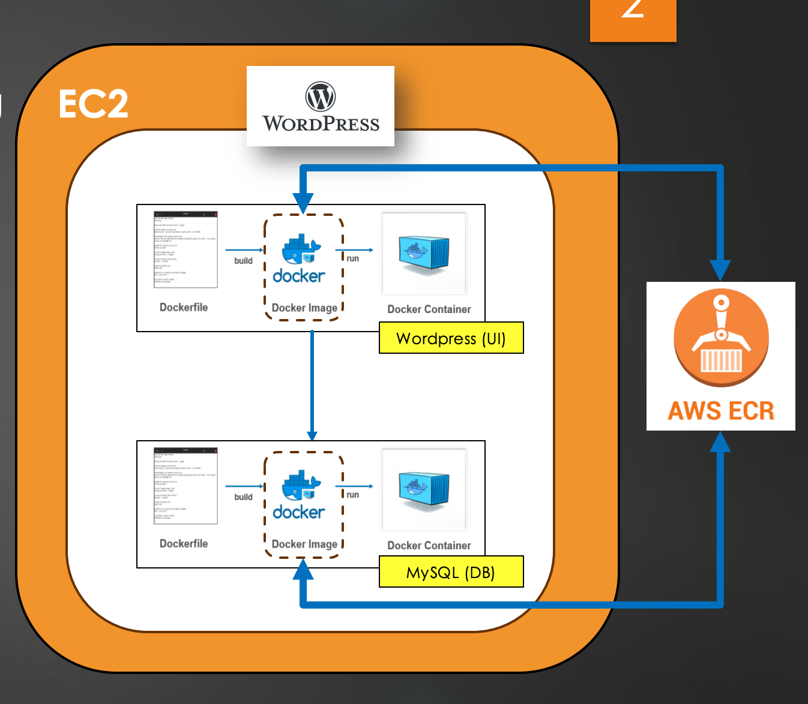

# 🚀 WordPress & MySQL on Docker with AWS ECR  

This project demonstrates how to containerize a **WordPress** application with a **MySQL** database using **Docker**, push the images to **AWS Elastic Container Registry (ECR)**, and deploy them as running containers.  

It includes:  
✅ Building custom Docker images for WordPress & MySQL  
✅ Storing and retrieving images from AWS ECR  
✅ Running WordPress and MySQL as Docker containers  
✅ Step-by-step guide to replicate the project  

## 🗺️ Architecture Diagram



---

## 📂 Project Structure  

```
├── Dockerfile.mysql    # Dockerfile for MySQL container  
├── Dockerfile.wp       # Dockerfile for WordPress container  
├── README.md           # Project Documentation  
```

---

## 🚀 Getting Started  

### 1️⃣ Prerequisites  

Ensure you have the following installed:  
- **Docker** 🐳  
- **AWS CLI** (configured with valid credentials)  
- **AWS Elastic Container Registry (ECR)** access  
- **Git** (to clone this repository)  

---

### 2️⃣ Clone the Repository  

```sh
git clone https://github.com/chetanchandane/aws-ecr-docker.git  
cd aws-ecr-docker
```
---

### 3️⃣ Build Docker Images  

First, build the MySQL image:  

```sh
docker build -t custom-mysql -f Dockerfile.mysql .
```

Next, build the WordPress image:  

```sh
docker build -t custom-wordpress -f Dockerfile.wp .
```

---

### 4️⃣ Run Containers Locally  

Start the MySQL container:  

```sh
docker run -d --name wordpress-db \
  -e MYSQL_ROOT_PASSWORD=rootpassword \
  -e MYSQL_DATABASE=blog \
  -e MYSQL_USER=wp_user \
  -e MYSQL_PASSWORD=wordpress \
  custom-mysql
```

Start the WordPress container:  

```sh
docker run -d --name wordpress-app \
  --link wordpress-db:mysql \
  -p 80:80 custom-wordpress
```

Your WordPress site should now be running on `http://localhost`.

---

## ☁️ Deploying to AWS Elastic Container Registry (ECR)  

### 5️⃣ Configure AWS CLI  

```sh
aws configure  
```

Enter your AWS credentials when prompted.  

---

### 6️⃣ Create an AWS ECR Repository  

```sh
aws ecr create-repository --repository-name cloud_614/wordpress-mysql --region us-east-1  
```

---

### 7️⃣ Authenticate Docker with AWS ECR  

```sh
aws ecr get-login-password --region us-east-1 | docker login --username AWS --password-stdin <AWS-ACCOUNT_ID>.dkr.ecr.us-east-1.amazonaws.com  
```

---

### 8️⃣ Tag & Push Images to AWS ECR  

Tag images:  

```sh
docker tag custom-wordpress:latest <AWS-ACCOUNT_ID>.dkr.ecr.us-east-1.amazonaws.com/cloud_614/wordpress-mysql:wordpress  
docker tag custom-mysql:latest <AWS-ACCOUNT_ID>.dkr.ecr.us-east-1.amazonaws.com/cloud_614/wordpress-mysql:mysql  
```

Push images:  

```sh
docker push <AWS-ACCOUNT_ID>.dkr.ecr.us-east-1.amazonaws.com/cloud_614/wordpress-mysql:wordpress  
docker push <AWS-ACCOUNT_ID>.dkr.ecr.us-east-1.amazonaws.com/cloud_614/wordpress-mysql:mysql  
```

---

### 9️⃣ Pull Images from AWS ECR  

```sh
docker pull <AWS-ACCOUNT_ID>.dkr.ecr.us-east-1.amazonaws.com/cloud_614/wordpress-mysql:mysql  
docker pull <AWS-ACCOUNT_ID>.dkr.ecr.us-east-1.amazonaws.com/cloud_614/wordpress-mysql:wordpress  
```

---

### 🔟 Run Containers from AWS ECR Images  

```sh
docker run -d --name mysql-container \
  -e MYSQL_ROOT_PASSWORD=rootpassword \
  -e MYSQL_DATABASE=blog \
  -e MYSQL_USER=wp_user \
  -e MYSQL_PASSWORD=wordpress \
  <AWS-ACCOUNT_ID>.dkr.ecr.us-east-1.amazonaws.com/cloud_614/wordpress-mysql:mysql
```

```sh
docker run -d --name wordpress-container \
  --link mysql-container:mysql \
  -p 80:80 <AWS-ACCOUNT_ID>.dkr.ecr.us-east-1.amazonaws.com/cloud_614/wordpress-mysql:wordpress
```

Your **WordPress** site is now deployed via **AWS ECR**! 🎉  

---

## 🏆 Key Highlights  

- Built and containerized **WordPress** & **MySQL**  
- Hosted images in **AWS Elastic Container Registry (ECR)**  
- Automated deployment using **Docker**  

---

## 🤝 Contributing  

Want to improve this project? Fork it, make your changes, and submit a PR! 🚀  

